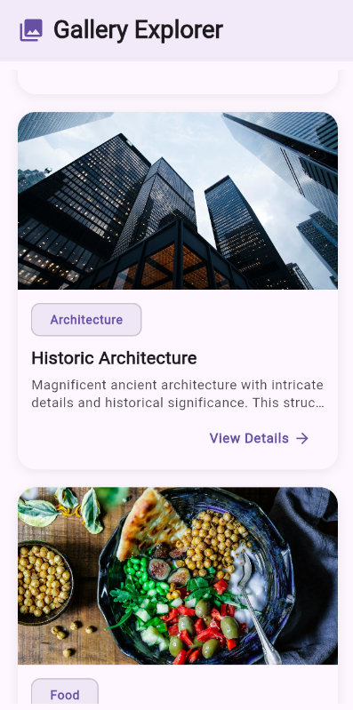
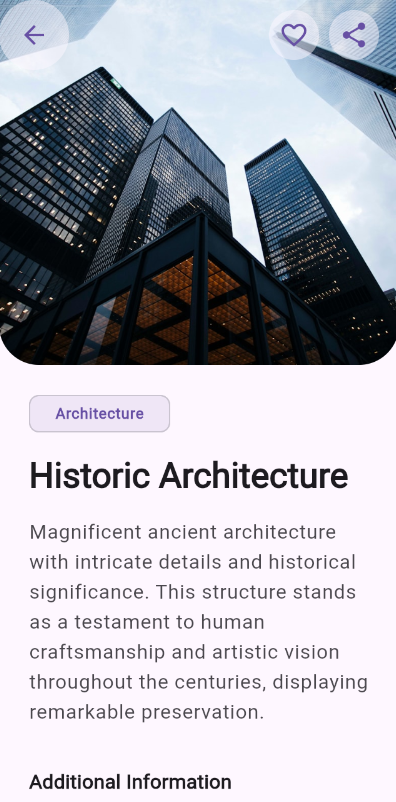

# Gallery Explorer

## Overview
Gallery Explorer is a Flutter app that displays a list of images with a modern look. When you tap on an image, the app uses the Hero animation to open a screen with more details about it, creating a smooth and immersive transition.
## Features

- **Elegant UI Design**: Beautiful, responsive interface with fluid animations
- **Image Gallery**: Browse through a collection of high-quality images
- **Detailed View**: Comprehensive information about each image with hero animation transitions
- **Interactive Elements**: Buttons for download, collections, favorites, and sharing
- **Error Handling**: Graceful handling of loading states and error conditions
- **Responsive Layout**: Adapts to different screen sizes and orientations
- **Dark Mode Support**: Automatic theme switching based on system preferences

## Screenshots




## Getting Started

### Prerequisites

- Flutter SDK (3.0.0 or higher)
- Dart SDK (3.0.0 or higher)
- Android Studio / VS Code
- An emulator or physical device for testing

### Installation

1. Clone this repository
   ```
   git clone https://github.com/yourusername/gallery_explorer.git
   ```

2. Navigate to the project folder
   ```
   cd gallery_explorer
   ```

3. Install dependencies
   ```
   flutter pub get
   ```

4. Run the app
   ```
   flutter run
   ```

## Project Structure

The project follows a well-organized folder structure:

```
lib/
├── main.dart         # App entry point with MaterialApp configuration
├── theme.dart        # Theme definitions for light and dark mode
├── image_util.dart   # Utility for image handling
├── models/           # Data models
│   └── item_model.dart
├── data/             # Data repositories
│   └── item_repository.dart
├── providers/        # State management
│   └── item_provider.dart
├── screens/          # Full screen UI
│   ├── item_list_screen.dart
│   └── item_detail_screen.dart
└── widgets/          # Reusable UI components
    ├── hero_image.dart
    └── item_card.dart
```

## Architecture

This project follows a simple but effective architecture pattern:

1. **Data Layer**: Repository pattern for data sources
2. **Business Logic Layer**: Provider for state management
3. **Presentation Layer**: Screens and widgets for UI

The app implements smooth hero animations when navigating between the list and detail screens, creating a seamless visual transition for gallery items.

## Dependencies

- **flutter**: Core framework
- **provider**: State management
- **cached_network_image**: Efficient image loading and caching
- **google_fonts**: Custom typography
- **shared_preferences**: Local data persistence
- **uuid**: Generating unique identifiers

## License

This project is licensed under the MIT License - see the LICENSE file for details.

## Acknowledgments

- Images provided by various sources for demonstration purposes